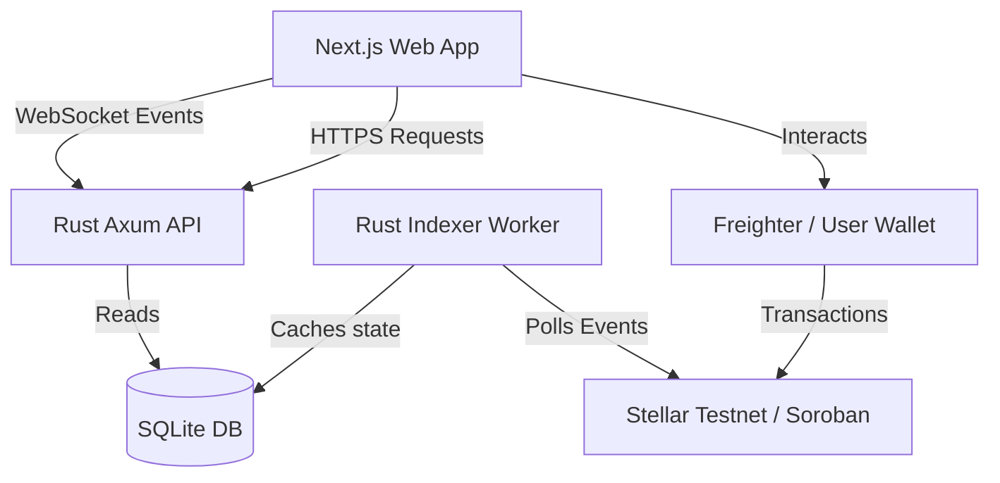

# 🛡️ Stellar Pharma Chain (SPC)

[](https://stellar.org)
[](https://nextjs.org)
[](https://www.rust-lang.org)
[](https://sqlite.org)

An enterprise-grade, trustless pharmaceutical supply chain tracking and cryptographic verification platform powered by **Stellar / Soroban Smart Contracts**. SPC protects patients and distributors from counterfeit drugs by establishing an immutable, verifiable custody chain (Manufacturer ➡️ Distributor ➡️ Pharmacy) and capturing real-time cold-chain telemetry.

---

## 🎨 User Interface Showcase

The system features a premium, responsive dashboard with tailored role management, real-time WebSocket logs, and interactive timelines. Below are the interface screenshots representing different views in the application:

### 1. Control Center Dashboard
A high-level command center displaying real-time synchronization with the Soroban ledger, connected nodes, recent validation metrics, active security alerts, and live event logs.


---

### 2. Manufacturer Batch Registry Portal
A dedicated workspace for licensed drug manufacturers to mint pharmaceutical batches. Manufacturers can input batch parameters, generate secure QR codes, and sign cryptographic hashes to record them on-chain.


---

### 3. Distributor Handover & Transit Portal
A logistics dashboard for transit operators to accept batches from manufacturers, update custody, and log real-time telemetry like temperature and humidity.


---

### 4. Pharmacy Verification & Inventory
An interface for pharmacists to inspect incoming deliveries. Pharmacists can confirm proof of origin, view the custody chain, manage regional inventory, and mark drugs as safely dispensed to patients.


---

### 5. Secure Drug Authentication Scanner
A mobile-optimized scanning interface for inspectors, retailers, or patients to scan drug QR codes, instantly checking authenticity and recall status against the Stellar blockchain.


---

### 6. Batch Verification & Custody Timeline
An interactive visual trace showing the lifecycle of a batch from its creation, through logistics handovers, down to pharmacy receipt, including cold-chain sensor graphs and excursion warnings.


---

### 7. Security Alerts & Recall Center
A threat monitoring console that flags anomalous transactions, temperature excursions, and unauthorized custody transfers. Licensed manufacturers can also execute instant on-chain recalls here.


---

### 8. Node Settings & Wallet Configuration
Configure Freighter or custom Stellar wallets, manage network credentials, view testnet XLM balances, update Soroban RPC nodes, and swap user roles for development.


---

## ⚙️ Architecture & Component Overview

SPC is split into three main modules orchestrated within a single Cargo workspace:



### 1. Smart Contracts (`contracts/`)
Written in Rust using the Soroban SDK.
*   **`batch-registry`**: Manages drug batch metadata (name, manufacturer, expiry, status, recall flags).
*   **`custody-chain`**: Tracks the movement of drug quantities between cryptographic addresses and ensures strict checks (preventing expired transfers, enforcing manufacturer recalls).
*   **`pharma-types`**: Shared types, structs, and enums representing participants (`Manufacturer`, `Distributor`, `Pharmacy`, `Patient`).

### 2. Backend API & Indexer (`backend/`)
Built with Rust, Axum, and Sqlx.
*   **Background Indexer**: Continuously monitors the Soroban RPC for events emitted by the contracts, parses XDR, and caches custody/telemetry logs locally in SQLite.
*   **Axum Web API**: Serves JSON APIs for fast frontend queries (avoiding slow RPC lookups for historical traces).
*   **WebSockets**: Broadcasts real-time events (e.g. new registrations, transfers, and recalls) to the connected web clients.

### 3. Frontend Portal (`frontend/`)
A Next.js 15 single-page application styled using modern dark-mode CSS tokens, supporting interactive charts, real-time alert logs, and role simulations.

---

## 🚀 Installation & Local Setup

### Prerequisites
Make sure you have the following installed on your system:
- **Node.js** (v18+) & npm
- **Rust** (stable toolchain)
- **Stellar CLI** (to target local Soroban environments if needed)

---

### Step 1: Deploy Smart Contracts
We use a Node-based deploy CLI helper that builds the WASM bytecode, deploys to Stellar Testnet, and generates the necessary configurations automatically.

1. Install the CLI dependencies and deploy the contract:
   ```bash
   # Run the deployment orchestrator directly from the workspace root
   cargo run -p deploy-cli
   ```
2. The orchestrator will output the contract IDs into a `.env` file at the root.

---

### Step 2: Start the Backend API
The Rust backend runs the event indexer and the HTTP/WebSocket server.

1. Navigate to the backend directory and configure the environment (if not automatically created):
   ```bash
   cd backend
   # Start the Rust application
   cargo run
   ```
2. The backend will initialize the SQLite database (`pharma.db`), run migrations, and start listening on `http://localhost:8080`.

---

### Step 3: Launch the Frontend
1. Navigate to the frontend directory:
   ```bash
   cd ../frontend
   npm install
   ```
2. Run the Next.js development server:
   ```bash
   npm run dev
   ```
3. Open [http://localhost:3000](http://localhost:3000) in your browser.

---

## 🔒 Security Features & Rules

> [!IMPORTANT]
> **Expiry Enforcements**: The `custody-chain` contract queries the ledger timestamp. Any attempt to transfer or register an expired batch will trigger an immediate transaction revert.

> [!WARNING]
> **Emergency Recalls**: Once a manufacturer recalls a batch, the `batch-registry` updates the on-chain recall status. All downstream custody movements for that batch ID are immediately frozen.

> [!NOTE]
> **Cold-Chain Telemetry**: Every transit transition logs temperature records. If temperature limits are exceeded, the indexer issues a system-wide WebSocket alert for quality checkups.
