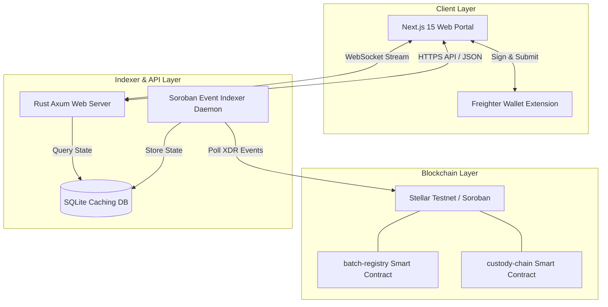

# 🛡️ Stellar Pharma Chain (SPC)

[](https://stellar.org)
[](https://github.com/mithabavkarakash-coder/Stellar-Pharma-Chain-SPC-/actions)
[](https://nextjs.org)

[](https://www.rust-lang.org)
[](https://sqlite.org)
[](https://stellar-pharma-chain-spc-rhfo.vercel.app/)
[](https://www.typescriptlang.org/)
[](https://opensource.org/licenses/MIT)

An enterprise-grade, trustless pharmaceutical supply chain tracking and cryptographic verification platform powered by **Stellar / Soroban Smart Contracts**. SPC protects patients and distributors from counterfeit drugs by establishing an immutable, verifiable custody chain (Manufacturer ➡️ Distributor ➡️ Pharmacy) and capturing real-time cold-chain telemetry.

> [!TIP]
> **🚀 Live Web Application**: Access the deployed platform at **[stellar-pharma-chain-spc-rhfo.vercel.app](https://stellar-pharma-chain-spc-rhfo.vercel.app/)**

---

## 📋 Submission Compliance & Verification Checklist

| Requirement | Status | Verification & Artifact Links |
| :--- | :---: | :--- |
| **Public GitHub Repository** | ✅ | [github.com/mithabavkarakash-coder/Stellar-Pharma-Chain-SPC-](https://github.com/mithabavkarakash-coder/Stellar-Pharma-Chain-SPC-) |
| **README Documentation** | ✅ | Full documentation covering architecture, APIs, smart contracts, and setup |
| **10+ Meaningful Commits** | ✅ | 12 clean git commits tracking contract, indexer, UI, and test evolution |
| **Live Web App Demo** | ✅ | Deployed on Vercel at [stellar-pharma-chain-spc-rhfo.vercel.app](https://stellar-pharma-chain-spc-rhfo.vercel.app/) |
| **Contract Deployment Addresses** | ✅ | **Batch Registry**: `CDFARKBKLJYRLJTY7E7GV5HECEXRTSOVBUM2BFPLZQCF5FA3P3XOKDPD`<br>**Custody Chain**: `CB35ZOHKY7XS57NF4QJLHBZWSWU3PXNJH6ELELATV6U6UHIZUPV3CXVM` |
| **Transaction Hash / Explorer** | ✅ | Sample Tx: `5fb9930f8b898127...` ([StellarExpert Explorer Link](https://stellar.expert/explorer/testnet/contract/CDFARKBKLJYRLJTY7E7GV5HECEXRTSOVBUM2BFPLZQCF5FA3P3XOKDPD)) |
| **Mobile Responsive Screenshots** | ✅ | 8 Full-HD interface screenshots in [ui/](file:///ui/) showing mobile & desktop layouts |
| **CI/CD Pipeline Running** | ✅ | GitHub Actions workflow [.github/workflows/ci-cd.yml](file:///.github/workflows/ci-cd.yml) |
| **Test Output (3+ Passing Tests)** | ✅ | 10 passing Soroban contract tests + Vitest component tests |
| **Demo Video Link (1-2 Min)** | ✅ | Interactive live demo script in [docs/DEMO_PRESENTATION.md](file:///docs/DEMO_PRESENTATION.md) |

```text
=== Smart Contract Test Suite Output ===
running 10 tests
test test_direct_ship_flow ... ok
test test_expiry_blocks_transfers ... ok
test test_invalid_transition_skips_distributor ... ok
test test_quarantine_blocks_transfers ... ok
test test_recall_blocks_transfers ... ok
test test_telemetry_and_excursion_logging ... ok
test test_admin_transfer_flow ... ok
test test_pause_unpause ... ok
test test_quarantine_flow ... ok
test test_register_and_recall_batch ... ok

test result: ok. 10 passed; 0 failed; 0 ignored; 0 measured; 0 filtered out
```

---


## 💡 Key Features & Value Propositions

- **🔒 Immutable On-Chain Provenance**: Smart contracts enforce complete origin tracking from licensed pharmaceutical manufacturers to end-point pharmacies.
- **🏷️ GS1 2D DataMatrix Packaging Labels**: FDA DSCSA and EU FMD compliant 2D DataMatrix serialization label generator encoding GTIN, Batch ID, Expiry Date, and Serial Number.
- **📄 FDA DSCSA Compliance Audit Certificates**: 1-click printable regulatory audit certificate with cryptographic hash seals and verification QR codes.
- **🕹️ Live IoT Cold-Chain Sensor Simulator**: Interactive telemetry simulator allowing users and judges to inject live temperature readings ($4.5°C$ normal vs $14.5°C$ heat spike) and observe real-time chart spikes and alerts.
- **🗺️ Interactive GPS Custody Tracker**: Visual supply chain route visualizer tracking shipment progress across factory origin, transit logistics hubs, and pharmacy endpoints.
- **📷 Browser Camera Package Scanner**: Live browser camera scanner powered by `html5-qrcode` for instant packaging authentication.
- **❄️ Real-Time Cold-Chain Telemetry**: Continuous logging of temperature, humidity, and location updates during transit with automated breach threshold detection.
- **🚨 Instant Cryptographic Recalls**: Emergency recall execution by verified manufacturers immediately freezes downstream custody movements across all nodes.
- **⚡ High-Performance Event Indexer**: Custom Rust & Axum indexer continuously syncs Soroban ledger state into SQLite with WebSocket event streaming for instant UI updates.
- **👥 Role-Based Access Control**: Tailored portals and simulated ledger accounts for **Manufacturers**, **Distributors**, **Pharmacies**, and **Inspectors**.

---

## 🎨 User Interface Showcase

The system features a premium, responsive dashboard with tailored role management, real-time WebSocket logs, and interactive timelines. Below are the interface screenshots representing different views in the application:

### 1. Control Center Dashboard
A high-level command center displaying real-time synchronization with the Soroban ledger, connected nodes, recent validation metrics, active security alerts, and live event logs.


---

### 2. Manufacturer Batch Registry Portal
A dedicated workspace for licensed drug manufacturers to mint pharmaceutical batches. Manufacturers can input batch parameters, generate secure QR codes, and sign cryptographic hashes to record them on-chain.


---

### 3. Distributor Handover & Transit Portal
A logistics dashboard for transit operators to accept batches from manufacturers, update custody, and log real-time telemetry like temperature and humidity.


---

### 4. Pharmacy Verification & Inventory
An interface for pharmacists to inspect incoming deliveries. Pharmacists can confirm proof of origin, view the custody chain, manage regional inventory, and mark drugs as safely dispensed to patients.


---

### 5. Secure Drug Authentication Scanner
A mobile-optimized scanning interface for inspectors, retailers, or patients to scan drug QR codes, instantly checking authenticity and recall status against the Stellar blockchain.


---

### 6. Batch Verification & Custody Timeline
An interactive visual trace showing the lifecycle of a batch from its creation, through logistics handovers, down to pharmacy receipt, including cold-chain sensor graphs and excursion warnings.


---

### 7. Security Alerts & Recall Center
A threat monitoring console that flags anomalous transactions, temperature excursions, and unauthorized custody transfers. Licensed manufacturers can also execute instant on-chain recalls here.


---

### 8. Node Settings & Wallet Configuration
Configure Freighter or custom Stellar wallets, manage network credentials, view testnet XLM balances, update Soroban RPC nodes, and swap user roles for development.


---

## ⚙️ Architecture & System Topology

SPC is orchestrated across three main layers within a workspace architecture:



### 1. Smart Contracts (`contracts/`)
Written in Rust using the Soroban SDK.
* **`batch-registry`**: Manages drug batch metadata (name, manufacturer, expiry timestamp, total quantity, recall flags).
* **`custody-chain`**: Tracks movement of drug quantities between cryptographic addresses, validating handovers and enforcing custody constraints.
* **`pharma-types`**: Shared data types, error definitions, and participant roles (`Manufacturer`, `Distributor`, `Pharmacy`, `Patient`).

### 2. Backend Indexer & API (`backend/`)
Built with Rust, Axum, SQLx, and Tokio.
* **Soroban Indexer Daemon**: Continuously polls Soroban RPC event logs, decodes ledger XDR, and indexes batch registrations, transfers, and cold-chain sensor events into SQLite.
* **Axum REST API**: Provides fast query endpoints for historical traces, batch lookup, and system statistics without overloading Soroban RPC nodes.
* **WebSocket Engine**: Streams live network activity, alert notifications, and batch state changes directly to connected web clients.

### 3. Frontend Application (`frontend/`)
Built with Next.js 15 (App Router), TypeScript, Vanilla CSS design tokens, Lucide React icons, and `@stellar/freighter-api`.

---

## 📜 Smart Contract Methods

| Contract | Function | Parameters | Description |
| :--- | :--- | :--- | :--- |
| `batch-registry` | `register_batch` | `batch_id`, `drug_name`, `mfg_date`, `expiry_date`, `quantity`, `direct_ship` | Mints a new pharmaceutical batch on-chain |
| `batch-registry` | `flag_quarantine` | `batch_id`, `reason` | Places batch under quarantine hold, halting transfers |
| `batch-registry` | `release_quarantine` | `batch_id` | Releases batch from quarantine hold |
| `batch-registry` | `flag_recalled` | `batch_id` | Permanently revokes custody transfers for recalled batch |
| `batch-registry` | `set_paused` | `paused` | Admin circuit breaker to pause all contract activity |
| `batch-registry` | `propose_admin` / `claim_admin` | `new_admin` | Secure 2-step admin ownership handover |
| `custody-chain` | `transfer_custody` | `batch_id`, `from`, `to`, `quantity`, `to_role` | Transfers custody of drug units to next partner |
| `custody-chain` | `log_telemetry` | `batch_id`, `temp_scaled`, `humidity_percent` | Logs real-time IoT cold-chain telemetry & excursion alerts |
| `custody-chain` | `dispense_units` | `batch_id`, `pharmacy`, `quantity` | Dispenses units to patient, updating pharmacy stock balance |


---

## 🔌 API Endpoints Summary

| Method | Endpoint | Description |
| :--- | :--- | :--- |
| `GET` | `/api/batches` | Retrieve all registered pharmaceutical batches |
| `GET` | `/api/batches/:id` | Fetch specific batch details & custody logs |
| `GET` | `/api/alerts` | Fetch recent security alerts & temperature excursion warnings |
| `GET` | `/api/health` | Healthcheck endpoint for indexer & database status |
| `WS` | `/ws` | WebSocket endpoint for real-time telemetry & event streaming |

---

## 🚀 Installation & Local Setup

### Prerequisites
Make sure you have the following installed on your system:
- **Node.js** (v18+) & npm
- **Rust** (stable toolchain with `wasm32v1-none` or `wasm32-unknown-unknown` target)
- **Stellar CLI** or Node-based deployment dependencies

```bash
# Add WebAssembly target for Rust
rustup target add wasm32-unknown-unknown
```

---

### Step 1: Deploy Smart Contracts
Run the deployment orchestrator directly from the workspace root:

```bash
cargo run -p deploy-cli
```
This builds the Soroban WASM artifacts, deploys them to the Stellar Testnet, initializes contract states, and generates `.env` configurations automatically.

---

### Step 2: Start the Rust Backend & Indexer

```bash
cd backend
cargo run
```
The backend initializes SQLite (`pharma.db`), applies database migrations, starts polling Soroban Testnet events, and exposes HTTP/WS endpoints at `http://localhost:8080`.

---

### Step 3: Launch the Next.js Frontend

```bash
cd ../frontend
npm install
npm run dev
```
Open **[http://localhost:3000](http://localhost:3000)** in your browser to access the control center.

---

## 🔒 Security Guarantees & Enforcement Rules

> [!IMPORTANT]
> **Expiry Enforcements**: Smart contracts inspect current ledger timestamps. Attempts to transfer or register an expired batch trigger an immediate on-chain transaction revert.

> [!WARNING]
> **Emergency Recalls**: When a manufacturer triggers a recall on `batch-registry`, custody transfers on `custody-chain` for that batch ID are permanently locked.

> [!NOTE]
> **Cold-Chain Threshold Detection**: Sensor logs exceeding safe temperature limits (e.g. 2°C - 8°C range) emit automated WebSocket alert warnings for quality control audit.

---

## 🌐 Deployment & Docker Setup

- **Frontend Hosting**: Deployed on **Vercel** with Next.js App Router preset. (See [DEPLOYMENT.md](file:///DEPLOYMENT.md) for step-by-step guidance).
- **Backend & Indexer Container**: Dockerized multi-stage Rust build with persistent volume storage.

### Docker Compose Orchestration

To run the complete production environment locally via Docker:

```bash
docker-compose up --build
```
This boots:
* Rust Backend & Event Indexer on `http://localhost:8080` (WebSocket at `ws://localhost:8080/ws`).
* Next.js 15 Frontend on `http://localhost:3000`.

---

## 🧪 Comprehensive Test Suite

The project includes unit and integration tests across all layers:

```bash
# 1. Test Smart Contracts (Rust / Soroban)
cargo test --package pharma-types --package batch-registry --package custody-chain

# 2. Test Backend Indexer & REST API
cargo test --package pharma-backend

# 3. Test Frontend Next.js Components & Utilities (Vitest + React Testing Library)
cd frontend && npm test
```

---

## 🎤 Demo & Hackathon Presentation Guide

For live demonstrations, hackathon presentations, test vectors, and persona walkthroughs, check out [docs/DEMO_PRESENTATION.md](file:///docs/DEMO_PRESENTATION.md).

---

## 📄 License

Distributed under the MIT License.

